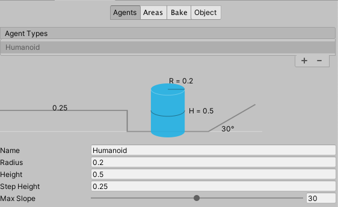

# Final Project in CPSC 6820-3D Game Programming
### Team Name: Refulgence
### Team Member: Zhongyue Ren, Wufangjie Ma

### Our website
[website](https://mwfj.github.io/Final_Project_in_3D_Game/ "website")

For our lastest update, see this link: [update](https://mwfj.github.io/Final_Project_in_3D_Game/update "update")

## Our Second playable versioin:
[Game_Instruction](https://mwfj.github.io/Final_Project_in_3D_Game/First_Playable_version/README.md) 

[Second_Playable_version](https://mwfj.github.io/Final_Project_in_3D_Game/Second_Playerable_version/index.html)

 **Note that: Since our game map is dynamically generated, it will still take some time to generate the game map at the beginning of the game**

> Screenshot for our First Playable Version

> Screenshot for our SecondPlayable Version

## Import Assert
### If you want to import assert, please note that the scene name we use call **"Main"**.
### Then if you want to make runtime agnet work, plase manually change the NavMesh Agent setting and NavMesh Bake setting in the "Navigation" Window(Figure below)

>
>

### *More functional update please see the update page*

## [Final Proejct Proposal](https://mwfj.github.io/Final_Project_in_3D_Game/Final_Project_Proposal.pdf)

### What kind of game?

We would like to develop a 3d roguelike game. Players will take adventure in a randomly generated dungeon. The dungeon will have different rooms with different mechanism to unlock the next level. Different creeps which will drop random item, skills and equipment. It will much like a combination of *The Binding of Isaac* and *Risk of Rain 2*. The action mode in the risk of rain will provide stronger hitting feelings. The random room skill and boss generation is the key feature in roguelike game. 

> Screenshot of *The Binding of Isaac* from zhaodanji.com

> Screenshot of *Risk of Rain 2* from gamesky.com

### The Control and UI

We develop the game for PC and Mac OS platform and player will control the avatar with keyboard and mouse. The control system will much like prevalent action game, using mouse to control direction and basic attack, using keyboard to spell abilities and move. The game UI will show the HP and some more character information related to the game mechanism, we will  make it detail in later update.

### System to push player forward

We don't want players farm creeps a lot and make the game mechanism have no challenge. So we want to develop a system to push player forward. It may related to the time like the blood moon mechanism in *Zelda: Breath of the Wild*. Typically the creeps and bosses will become more strong and fierce as the time passes. But I think it is not the best solution to balance the progress and farm parts of the game. So after finish main game mechanisms we will consider it again and choose one we preferred.

### Scripts and assets

Since I (Zhongyue Ren) have implemented the base of random dungeon generation algorithm in maze game, we will focus on the scene build scripts. It will related to the game system, different kind of room, different kind of creeps and bosses. And the specific movement of creeps and bosses, we will develop it together, each person responsible for some creeps and bosses I think, and also responsible for the animation of the corresponding objects.  **We have not decided to use any third-party assert now**. Once decide to use it, we will update the information on our website

### Plan

1. First release: we will implement the random dungeon and the movement of the main character, attack spell and other movement. So the player at this phase can just do a trip in a virtual world. And we will find some art resource to help us make the world more fascinating. We may add some attackable target to test the data for damage and HP balance, but it may not have corresponding art resource like hit animation. It will depends on the workload and whether we can find proper resources on the internet.
2. Second release: we will add more creeps, skills and equipment. Also at this phase, a roguelike game with its main function will be finished. Item dropping, random rooms and battle with creeps and bosses. Since time is limited, we may design only one boss battle that provide challenges for players but not just farm and push. 

### Meeting time

We have online meetings every two-three days to confirm the progress through Zoom. 

