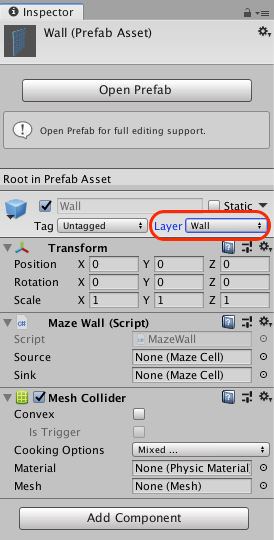
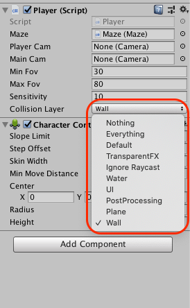
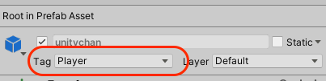
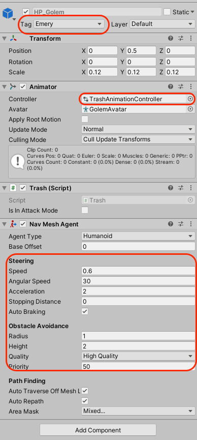
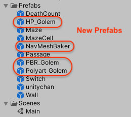
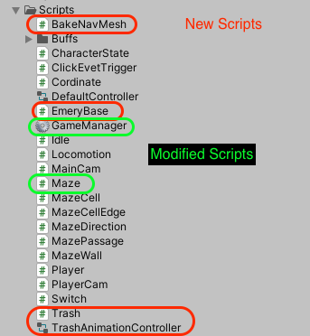
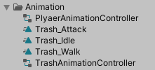
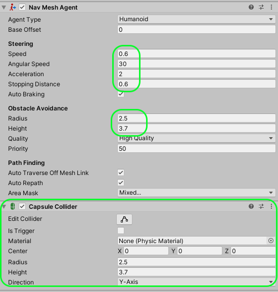

# Update
## (03/31/2020) **Decide our game topic and upload the final project proposal**

## (04/07/2020) **Division of labor for game development**

## (04/09/2020) **Post our first playable game**

In 04/09 updates we add a random maze and a boss room.  But currently no boss in it. We will put adds in the maze and boss in the room in next updates. 

 At this patch, the way connected to the boss room will open after click on all three 'switches'. There isn't a finish condition yet, because no boss there. 

* Add DeleteEdge(MazeDirection) function to the MazeCell class. Which can delete the wall or passage of the cell for that direction.
* Add abstract GetEdgeType() function to the MazeCellEdge class. Which should return the type of Edge.
* Override GetEdgeType() in class MazeWall and MazePassage.
* Add code to generate boss room. 
* Add conditions to open the door. 
* Now left click mouse will change the player camera angle from buttom to top for the future use, and click it again to resume the default camera angle
* Now scroll the mouse wheel will change the field of view for camera

## (04/14/2020) **Add Camera Collision detection, now camera won't across the Wall**

+ modify the code in Player.cs, where I change RayCast to LineCast for detecting the camera collision

+ change the layer of wall from "default" to "Wall" 
  

+  Set collision layer in Player.cs to "wall" in Unity Engine 
 
 
+ Change scene name to "Main"

+ Add Character Buff Utility

+ Add Unity-Chan Weapon Master assets package. Implementing jump function. 

    [Greatsword - Weapon Master Unity-Chan](https://assetstore.unity.com/packages/3d/animations/greatsword-weapon-master-unity-chan-103953)

+ Add new texture from Cartoon texture pack.

    [FREE Stylized PBR Textures Pack](https://assetstore.unity.com/packages/2d/textures-materials/free-stylized-pbr-textures-pack-111778)

=======
## (04/23/2020)  **Add Runtime Navmesh Baker and Agent**

[Repo_of_Runtime_NavMesh](https://github.com/Unity-Technologies/NavMeshComponents)

+ Now, our game can dynamically bake Nav Mesh.
+ The pic below is the configuration of Nav Mesh, where we use **Maze.prefab** as nav mesh plane

> 
> 

+ We add tag to Player call "Player"

> 

+ We add mobs/trash in the maze, which creates near to the player. We regard these trash as the Navmesh Agent, which chase player in the limited walkable navmesh distance and the tag "Emery" specific to  Trash/Boss in the future.
+ **Note that:** the trash has three types. When the game begin, our system will randomly choose the trash types, that **means each time you open the game, the numer of each type of trash may vary**.

> 

+ The pic below is the prefab  and script update
+ **Note that:** the class of  **"EmeryBase"**  is the abstract class, where all trashes and bosses must inherit this class. **BakeNavMesh** mainly response for building mesh; The logic of "Nav Agent" you can find in the class of **"Trash"**

> 
> 

##  (04/25/2020)  **Add mobs/trashed animation**

+ Now trash can walk to main character
+ When trash apporach to main chatacter, it will stop and trigger attack animation
+ Move the Trash's animation and all animation contoller to `Animation` folder

> 

+ Change Trash Prefabs's setting

> 

## (04/26/2020)  **Add Boss Creation and animation; Add trash/boss Health bar  and Attack system**
### Boss Creation
The boss creation is little complicated, when the main character turn all the switch on(3 in this game), boss room will open, and the location of door will automatically create a box collider to detect whether the main character enter the boss room or not. When the main character first enter the boss room, it will trigger this collider and boss will generate in the boss room.

### Health bar 
Add world space canvas to the enemy prefab, and change the fill account by the health point of the enemy.

If health equals 0, play the dying animation and destroy the object after the animation.

And the boss health bar will use the camera space, and is located at the top left of the screen. It will be activated when the boss is generated.

If we just set the canvas as a sub object of the enemy, the health bar will rotate with the enemy. We want it always face to our camera, so we add a script to dynamically detect the rotation and make sure the health bar is perfectly displayed.

###  Attack

**Detection** 

We use collision detection on the weapon model to check the attack. If the weapon hits the enemy, it will have an collision event.

Add collision trigger on the weapon. Using onTriggerStay to check the attack the collision for the enemy with a delay have the best performance. Because sometimes enter and leave will not occur at the same time as the animation event change the attacking stats. So trigger the attack count and then delay the next attack until current animation is finish will be the best.

**Hit Box** 

We should add additional box collider to check the attack. Because of the NaveMesh, some times the Weapon may not really attack on the enemy model, so a little bigger hit box should be added. This will improve the use experience.

## (04/27/2020)  **Add background music; Add main character/boss sound effect**

### Background music
There has two background sound in the game, when the main character in the maze, the game will play relatively soothing background music.

However, when the main character entered the boss room, the concert became relatively intense in order to give the player a sense of tension.

Moreover, when boss room opened, it will have sound effect to describe it.

When the main character kill boss, the background music will change to victory music.

### Character/Boss sound effect
Because the time limit, I only added sound effects for the main character and boss. When player run, attack and jump, it will have sound effect. When boss roar(introduce animation) and attack, it will have sound effect. We will add sound effect for all character in the future.

