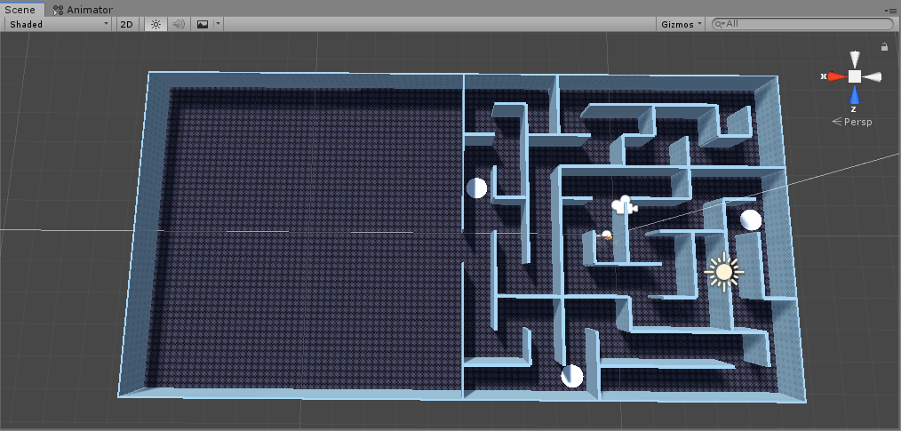

# Update
(03/31/2020) Decide our game topic and upload the final project proposal

(04/07/2020) Division of labor for game development

(04/09/2020) Post our first playable game

In 04/09 updates we add a random maze and a boss room.  But currently no boss in it. We will put adds in the maze and boss in the room in next updates. 

 At this patch, the way connected to the boss room will open after click on all three 'switches'. There isn't a finish condition yet, because no boss there. 

* Add DeleteEdge(MazeDirection) function to the MazeCell class. Which can delete the wall or passage of the cell for that direction.
* Add abstract GetEdgeType() function to the MazeCellEdge class. Which should return the type of Edge.
* Override GetEdgeType() in class MazeWall and MazePassage.
* Add code to generate boss room. 
* Add conditions to open the door. 
* Now left click mouse will change the player camera angle from buttom to top for the future use, and click it again to resume the default camera angle
* Now scroll the mouse wheel will change the field of view for camera

(04/14/2020) Add Camera Collision detection, now camera won't across the Wall

+ modify the code in Player.cs, where I change RayCast to LineCast for detecting the camera collision

+ change the layer of wall from "default" to "Wall" 
  

+  Set collision layer in Player.cs to "wall" in Unity Engine 
 
 
+ Change scene name to "Main"

+ Add Character Buff Utility

+ Add Unity-Chan Weapon Master assets package. Implementing jump function. 

    [Greatsword - Weapon Master Unity-Chan](https://assetstore.unity.com/packages/3d/animations/greatsword-weapon-master-unity-chan-103953)

+ Add new texture from Cartoon texture pack.

    [FREE Stylized PBR Textures Pack](https://assetstore.unity.com/packages/2d/textures-materials/free-stylized-pbr-textures-pack-111778)

